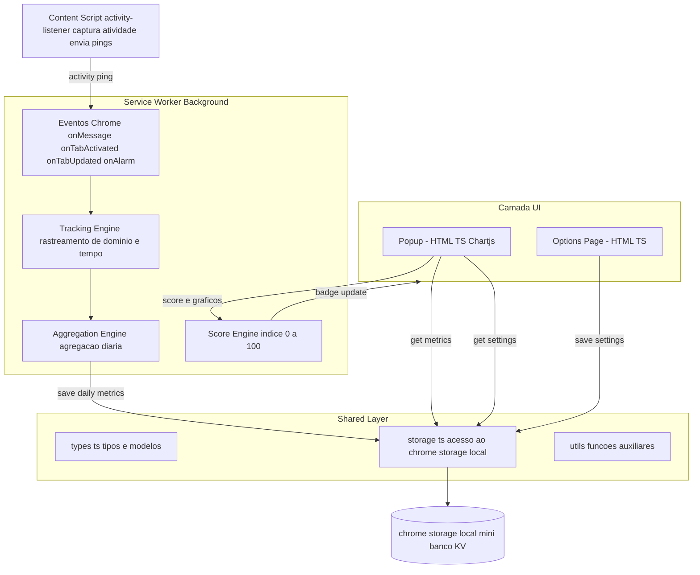

```mermaid
flowchart TD

    %% UI
    subgraph UI [Camada UI]
        P1[Popup - HTML TS Chartjs]
        P2[Options Page - HTML TS]
    end

    %% Content Script
    CS[Content Script activity-listener captura atividade envia pings]

    %% Service Worker
    subgraph SW [Service Worker Background]
        SW1[Eventos Chrome onMessage onTabActivated onTabUpdated onAlarm]
        SW2[Tracking Engine rastreamento de dominio e tempo]
        SW3[Aggregation Engine agregacao diaria]
        SW4[Score Engine indice 0 a 100]
    end

    %% Shared Layer
    subgraph SH [Shared Layer]
        SH1[types ts tipos e modelos]
        SH2[storage ts acesso ao chrome storage local]
        SH3[utils funcoes auxiliares]
    end

    %% Storage
    DB[(chrome storage local mini banco KV)]

    %% Fluxos
    CS -->|activity ping| SW1
    SW1 --> SW2
    SW2 --> SW3
    SW3 -->|save daily metrics| SH2
    SH2 --> DB

    P1 -->|get metrics| SH2
    P1 -->|get settings| SH2
    P1 -->|score e graficos| SW4

    P2 -->|save settings| SH2

    SW4 -->|badge update| UI
```